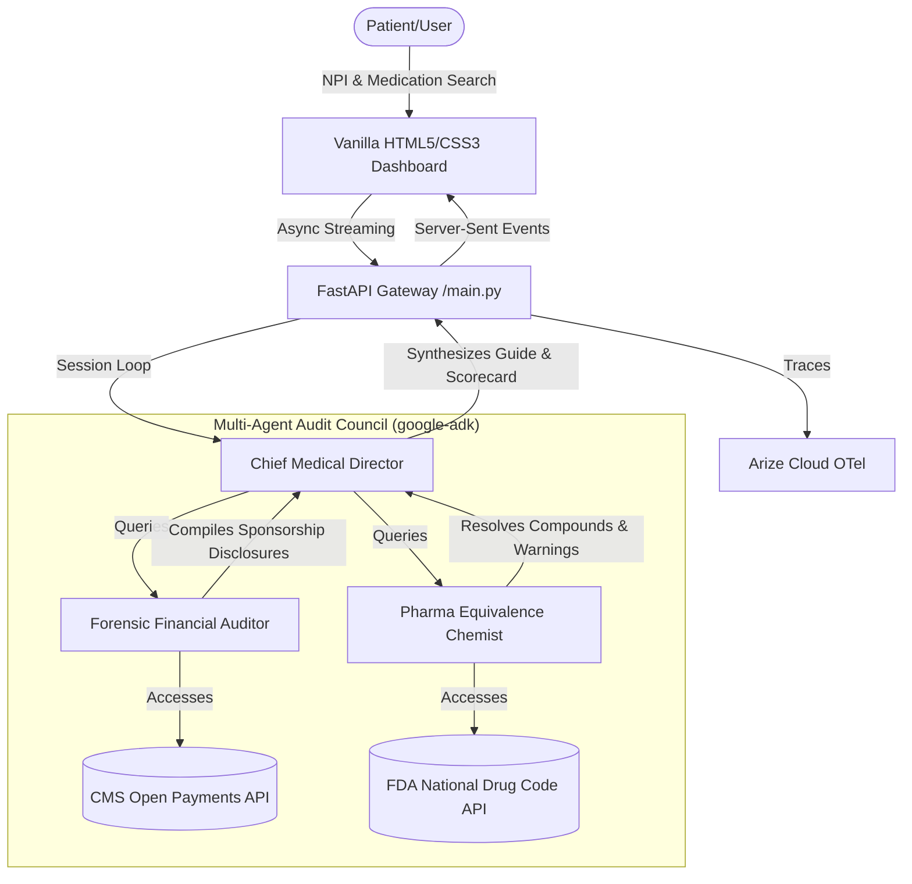

# DocTruth 🩺🔍
### Multi-Agent Physician Conflict of Interest (COI) Audit System

[](https://doctruth-619145132346.us-central1.run.app)
[](https://app.arize.com)
[](https://github.com/google/google-adk)
[](LICENSE)

**DocTruth** is a premium, high-fidelity clinical and corporate transparency dashboard designed to audit pharmaceutical sponsorships, expose prescribing biases, and protect patients. By orchestrating collaborative multi-agent structures, DocTruth correlates federal records of manufacturer payouts to licensed physicians with active drug chemistry databases to discover more affordable bio-equivalent alternatives.

---

## 🏛️ System Architecture

DocTruth utilizes **Google's declarative Agent Development Kit (`google-adk`)** to power a collaborative panel of expert medical-legal agents.



### Expert Roles:
1.  **Chief Medical Director (`agent.yaml`)**: The orchestrator who establishes audit targets, delegates investigative directives to sub-agents, and synthesizes clinical consultation reports with tailored questions for the patient’s next appointment.
2.  **Forensic Financial Auditor (`forensic_auditor.yaml`)**: Queries federal CMS registries to trace payment records, compiling total sponsorship amounts, consulting fees, speaker honoraria, and travel reimbursements.
3.  **Pharma Equivalence Chemist (`pharma_chemist.yaml`)**: Resolves chemical formulations, box warnings, and maps expensive brand-name medications to cost-effective generics and bio-similar alternatives.

---

## ✨ Features & Capabilities

*   **Interactive Multi-Agent Search**: Search for licensed physicians by last name, select their exact NPI card, and run highly paced multi-agent audits.
*   **Dual-Orchestration Streaming**: Real-time Server-Sent Events (SSE) stream the thoughts, tools calls, and discoveries of the agents as they compile information.
*   **Live Database Integrations**: 
    *   **CMS Open Payments**: Discloses exact financial correlations between prescribing physicians and manufacturing drug sponsors.
    *   **FDA National Drug Code (NDC)**: Evaluates drug chemistry, active ingredients, and box warnings.
*   **Context-Linked AI Clinical Advocate**: Includes a floating clinical consultant chat trained on the audited physician's exact financial profile, FDA safety logs, and active ingredient generic alternatives.
*   **Complete OpenTelemetry Tracing**: Every single agent handoff, prompt template, tool execution, and client message is traced and streamed securely to the **Arize Cloud (Phoenix AX)** platform.

---

## 🚀 Telemetry & Observability (Arize Cloud)

DocTruth is fully instrumented with standard OpenTelemetry protocols to allow full operational inspection of agentic pipelines.

*   **Prompt Template Versioning**: Tracks prompt versions and schemas under standard OpenInference attributes directly on the tracing spans.
*   **Manual Spans with Generator Safety**: Wraps async server-sent events in clean `try...finally` boundaries, preventing context leaks during streaming and ensuring 100% of spans land on the cloud dashboard.
*   **Secure OTel Auth Gateway**: Uses standard bearer token authentication and standard headers (`arize-space-id`, `arize-api-key`, `authorization`) to integrate with Arize Cloud gateways.

---

## 🛠️ Local Setup and Run

### Prerequisites
*   Python 3.11+
*   [uv](https://github.com/astral-sh/uv) (Extremely fast Python package installer and resolver)

### Installation
1.  Clone the repository:
    ```bash
    git clone <your-repo-url>
    cd zealous-pasteur
    ```
2.  Synchronize dependencies and launch virtual environment:
    ```bash
    uv sync
    ```
3.  Create a `.env` file in the root directory:
    ```env
    GEMINI_API_KEY="your-google-ai-studio-api-key"
    ARIZE_SPACE_ID="your-arize-space-id"
    ARIZE_API_KEY="your-arize-api-key"
    OTEL_EXPORTER_OTLP_TRACES_ENDPOINT="https://otlp.arize.com/v1/traces"
    ENABLE_LOCAL_PHOENIX=false
    ```

### Running Locally
Run the FastAPI development server:
```bash
.venv/bin/python main.py
```
Open your browser and visit: `http://localhost:8000`

---

## ☁️ Production Deployment

DocTruth is packaged with a lightweight, secure multi-stage `Dockerfile` and optimized to deploy seamlessly to **Google Cloud Run**.

The container uses `uvicorn` and dynamically binds to the port assigned by Google Cloud at runtime:
```dockerfile
CMD ["sh", "-c", "uvicorn main:app --host 0.0.0.0 --port ${PORT}"]
```

### To Deploy to GCP:
Run the pre-configured deployment script:
```bash
./deploy.sh
```
*Note: Make sure your `gcloud` CLI is authenticated and set to your target project.*

---

## 📝 License

Distributed under the MIT License. See [LICENSE](LICENSE) for more information.
